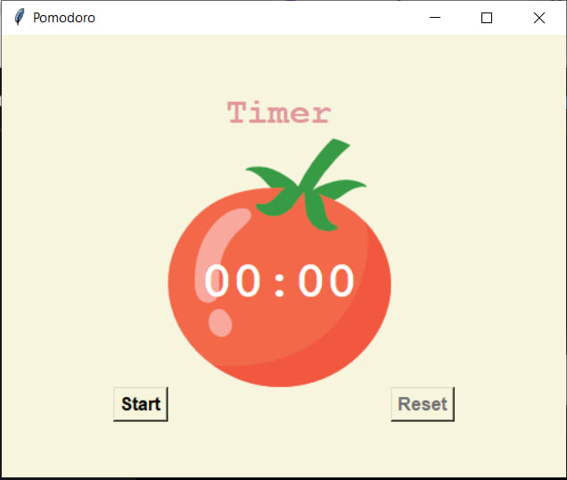
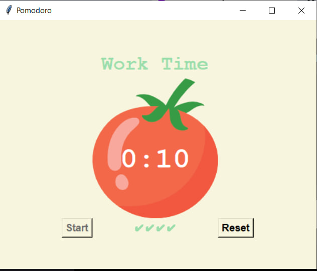
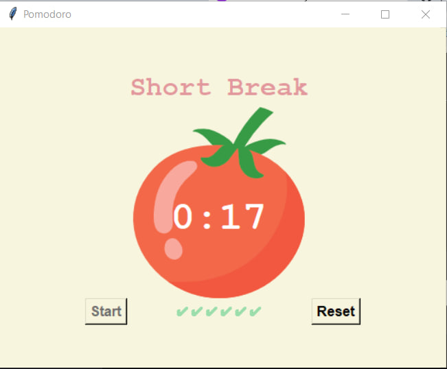
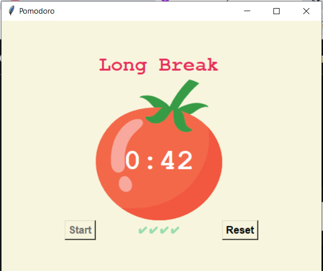

# Pomodoro Timer App

A simple productivity timer app built with Python's `tkinter` GUI toolkit.
This project demonstrates basic timer logic, GUI handling,
and the Pomodoro technique.

## Features

- Visual countdown timer with a tomato-themed interface.
- `Start` and `Reset` buttons with session tracking.
- Automatic switch between:
    - Work sessions
    - Short breaks
    - Long breaks (every 4 work sessions)
- Checkmark tracker to show completed work sessions.

## Technologies Used

- **Python 3.12.2**
- **`tkinter`, `math`**

